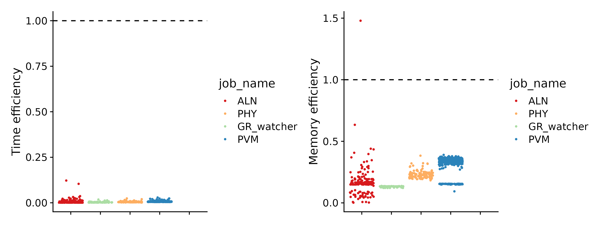
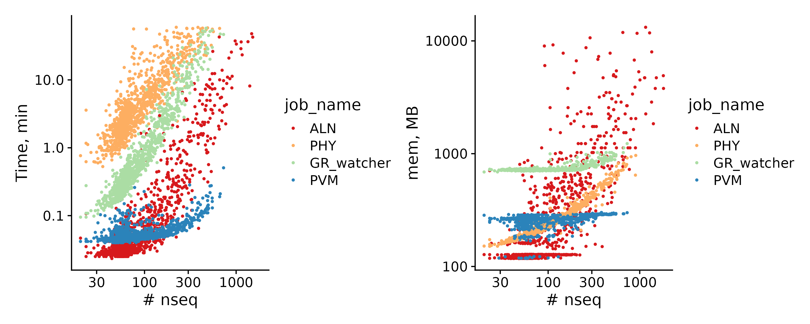
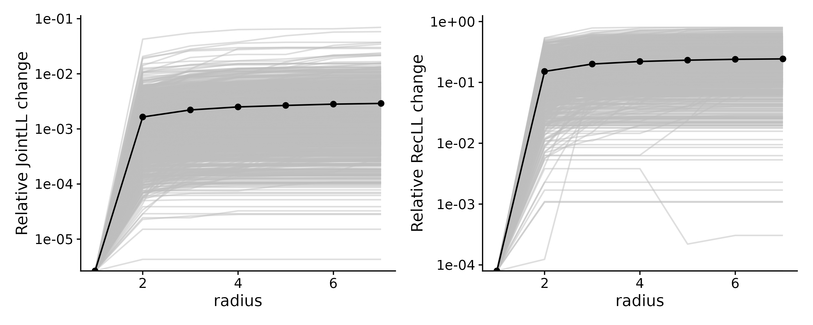
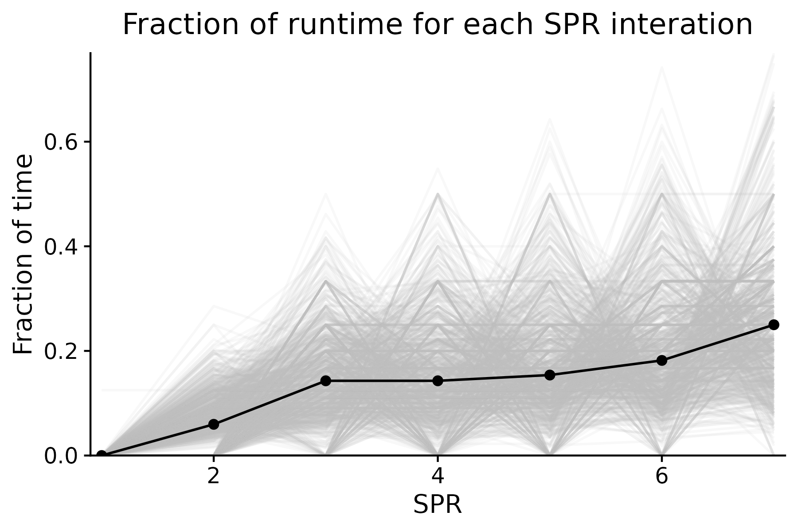

# Phylogeny pipeline for CRG HPC

0. prepare the input data - `data/input.fasta`    
1. search and clustering $\rightarrow$ homology groups. Select which HGs to run the pipeline for $\rightarrow$ `ids.txt`  
2. Alignment, phylogeny, possvm     
- optional: GeneRax + POSSVM
3. Gather the annotations per species  


Note: it seems that the strict file checks are now submitting the jobs that only perfom tests - massive waste of resources. 
__Add hg ids filtering script that will decide which hgs to run the processes for__ .

# Profiles   
There are 2 main flavours to run the pipeline:  
- `fast` - for testing, automatic `mafft`, `fasttree` and `max_spr` of the generax is set to 2 (suboptimal) 
- `precise` - LINSI mode, IQTREE2 with model testing, max_spr up to 7   

Execution:  
- `local` - use the interactive HPC session or run on your machine   
- `slurm` - configured to be used on the CRG HPC system   

To run a pipeline, combine the flavour and the executor. For instance `-profile local,fast` will run the fast pipeline locally. For submitting the jobs via slurm, you have to use a specific sbatch script `submit.nf` (vis the commands below).  


# Prepare inputs   
If you are planning to run GeneRax, you have to make sure i) your species tree contains all the prefixes present in the input fasta file; ii) strictly binary (expected by GeneRax) - i.e. no polytomies are present. To check the tree:   

```bash
python workflow/check_tree.py  data/species_tree.full.newick species_list data/species_tree.newick 
```

From a species list, get the proteomes from Xavi's database. You can as well just use custom proteomes concatenated into `data/input.fasta`  
```bash
bash workflow/prepare_fasta.sh species_list data/input.fasta
```

# Step1 - PFAM search and sequence clustering into homology groups (HGs) 

Interactive - usually much more convenient to run in the interactive session on the HPC.  

```bash
module load Java 
mamba activate phylo 
WORKDIR=/no_backup/asebe/gzolotarov/nextflow/phylohpc/work_step1
nextflow run -profile local -w $WORKDIR -resume step1.nf --genefam_info genefam.csv --infasta data/input.fasta -with-report reports/report.step1.html -with-trace reports/trace.step1.html
```

SLURM:  
```bash
module load Java 
mamba activate phylo 
WORKDIR=/no_backup/asebe/gzolotarov/nextflow/phylohpc/work_step1
sbatch --time=01:00:00 -J step1 submit_nf.sh step1.nf -resume -profile slurm -w $WORKDIR --report reports/report.step1.html --trace reports/trace.step1.txt --timeline reports/timeline.step1.html 
```

__Note__: Use `-profile slurm`  to run using the SLURM scheduler instead of locally. Use interactive jobs if `-profile local` unless you want Emyr coming to your desk!  


## Homology groups filtering  

Filter and get the list of homology groups to run the following steps for: 
```bash
grep -c '>' results/clusters/*HG*fasta | sed -E 's/:/\t/g' | sort -k 2 -n 

python workflow/select_hgs.py --out ids.txt --soi Mmus --min_seqs 20 --min_sps 5


# Explore the sequence stats
python workflow/get_seqstat.py  results/clusters/*.fasta | grep -f ids.txt -w | sort -k 2 -n 
# how to predict the d
```
* `--soi` - will keep only HG ids with `Mmus` sequences (it makes sense to filter by the reference species)  

Output: `ids.txt` file with selected homology groups. 

# Step 2 - HG phylogenies   

## 2.1 ADVANCED: Resource prediction  

Idea: use already executed jobs to predict the runtimes with quantile regression with `--tau` parameter (regression quantile). 

Inputs:
 - `seq_stat.tab` - generated by `workflow/get_seqstat.py` - contains the number of sequences and the median lengths  
 - trace file from nextflow - if you have never ran the pipeline, you can use some other trace files. 
  
Parameters:  
 - `tau` - quantile to perform a regression for. The model will predict the memory and the time for a given fasta for this quantile.  

Outputs:  
 - `workflow/models/models.json` - generated from fitting the models in R and converting to json by `train.R`  
 - `workflow/models/defaults.json` - contains default resource values for each job. Some jobs contain `large_nseq_threshold` value which means that for the HGs with the number of sequences above thisv value one can overwrite the values with `large_*` values. It is useful to set the maximum allowed resources for very big families - e.g. some TFs, adhesion proteins etc.
  
```json
{
  "ALN": {
    "mem": 500,
    "time": 30,
    "large_nseq_threshold": 1000,
    "large_mem": 50000,
    "large_time": 360
  },
  "PHY": {
    "mem": 500,
    "time": 30,
    "large_nseq_threshold": 1000,
    "large_mem": 1000,
    "large_time": 720
  },
  "PVM": { "mem": 500, "time": 5 },
  "GR":  { "mem": 2048, "time": 60, "large_nseq_threshold": 1000, "large_mem": 2048, "large_time": 360},
  "GR_watcher":  { "mem": 2048, "time": 60, "large_nseq_threshold": 1000, "large_mem": 2048, "large_time": 360}
}
```


Gather sequence stats and train the model. 
CAVE: standardize the input data - remove the parsing of the trace file!  


```bash
python workflow/get_seqstat.py  results/clusters/*.fasta > seq_stat.tab
TRACEFILE=reports/trace.step2.txt
Rscript train.R --trace $TRACEFILE --seq_stats seq_stat.tab --outfile workflow/models/models.json --plotfile workflow/models/models.pdf --tau 0.95
open workflow/models/models.pdf
```

Predict for `ids.txt`  
 
```bash
python workflow/predict_resources.py --ids_fn ids.txt --cluster_dir results/clusters --models_json workflow/models/models.json  --defaults_json workflow/models/defaults.json --outfile resources.tsv --max_mem 100000 --max_time 2880 --increase .5
```


## 2.2 Job submissions

```bash
module load OpenMPI
module load Java 
mamba activate phylo
```

Submit with predicted resources   

```bash
# Interactive session
WORKDIR=/no_backup/asebe/gzolotarov/nextflow/phylohpc/work_step2
PROFILE=local,precise
nextflow run -resume -profile $PROFILE -w $WORKDIR  step2.nf --run_generax --genefam_info genefam.csv --infasta data/input.fasta -with-report reports/report.step2.html -with-trace reports/trace.step2.html

# SLURM
PROFILE=slurm,precise
WORKDIR=/no_backup/asebe/gzolotarov/nextflow/phylohpc/work_step2
sbatch -J step2 -o reports/slurm.step2.out submit_nf.sh step2.nf -profile $PROFILE -resume --run_generax -w $WORKDIR --report reports/report.step2.html --trace reports/trace.step2.txt --timeline reports/timeline.step2.html  
```

`--run_generax` - use this flag to run `GeneRax` prior to `POSSVM`. 

# Gather annotations 

Gather the annotations per species of interest defined in the `sps_annotate` list:  
```bash
python workflow/gather_annotations.py --search-dir results/search/ --tree-dir results/possvm/ results/possvm_prev --id sps_annotate --outdir results/annotations/ --split-prefix

```

---

# Resource usage 

`dowstream_stats.R` - explores and plots resource usage. 

`generax_runtime.R` - explores the generax scaling. 
  




Job stats from SLURM job ids:
```bash
python workflow/check_job.py $(cat reports/trace.step2.txt | grep COMPL | grep ALN | cut -f 3 | grep -v native)
```

Collect SLURM job stats 
```bash
cat reports/trace.step2.txt  |grep -E "COMPLETED|CACHED"| cut -f 3 | grep -v native > job_ids
python workflow/check_job.v2.py -f job_ids > job_stats.tab
```
This info can be used to monitor the efficiency of the memory and time requests.   

`resources.R` - a downstream script that explores the resource scaling.  


### GeneRax   

`generax_stats.R`  
Joint likelihood change as a fraction of the SPR radius:   
It seems that most of the famies get their maximum increase after SPR=2. Thus, setting the SPR to 3 seems justified.     



The fraction of the total runtime spent in each iteration: 


Using maxspr = 3 will decrease the generax runtimes almost twice.  


---

# TODOs

- [ ] HG phylogenetic profiles   
- [ ] GeneRax: does sharing information across families improve the reconciliation?   
- [ ] resource efficiency reports    
- [ ] re-clustering - prevent diamond reruns during each re-clustering  
- [ ] re-clustering - use MMSEQS2  
- [ ] `phylo` environment with `Rscript` support  
- [ ] __allow the phylogeny script to rerun the iqtree if it finds the outputs?__ 
- [ ] __mafft oom errors (code 1 instesad of 137) - proper handling__ 
- [x] Gather annotations: if no generax annotation available, use the non-GeneRax'ed tree - added PVM_PREV  
- [x] generax: missing species in the tree - tree checks!  
- [x] 2 execution profiles - fast and precise
- [x] generax resource prediction   
- [x] quantile regression for resource prediction   
- [x] `generax.nf` - proper OOM and OOT handling  
- [x] proper environment with `openmpi` for generax  
- [x] `step2.nf` - make sure the processes are correctly cached and not rerun   
- [x] generax caching issue   
- [x] better subclustering logic in `phylogeny/`  
- [x] generax family error handling - raises exit 10  
- [x] Clustering: proper subclustering - local and global model  
- [x] GeneRax
- [x] `step1` - search and clustering pipeline   
- [x] `PHY` job time extension 
- [x] job duration and memory prediction  
- [x] proper job re-submission rules   


